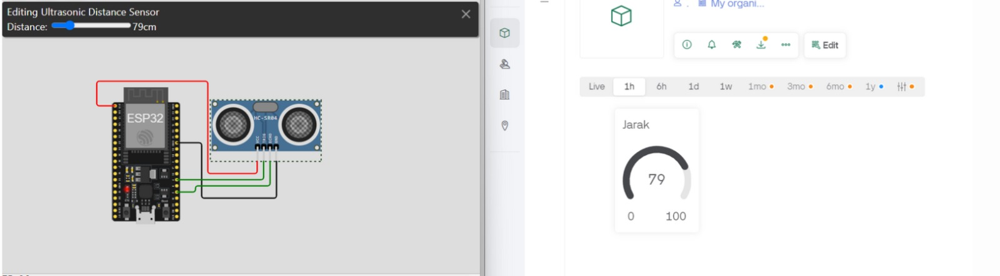
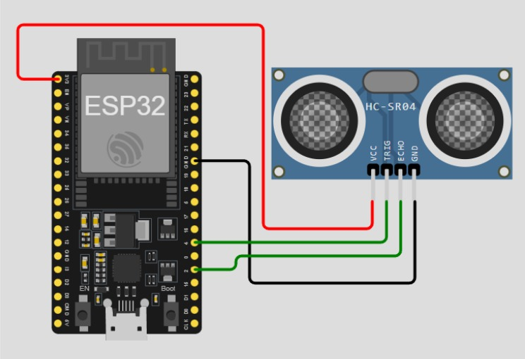

# Ultrasonic
 Monitoring sensor jarak (Ultrasonic) menggunakan aplikasi blynk, dengan memanfaat kan jaringan internet untuk mengirim data sensor dari nodemcu esp 8266 ke server blynk

 # RestAPI_GO
## Hasil

## Delete

